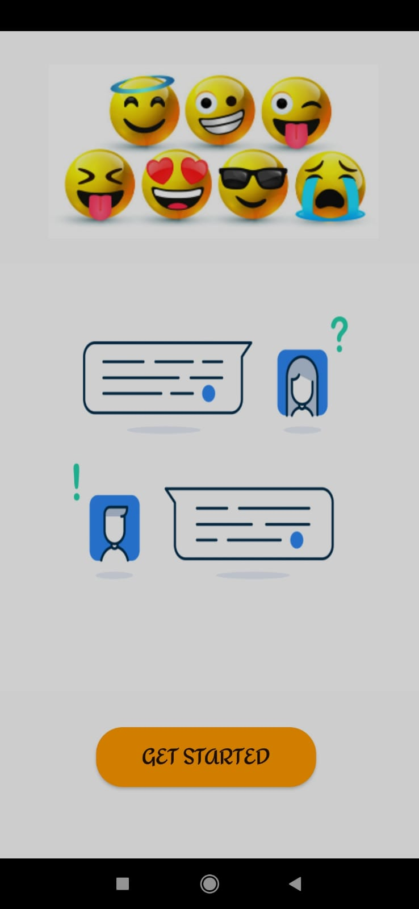
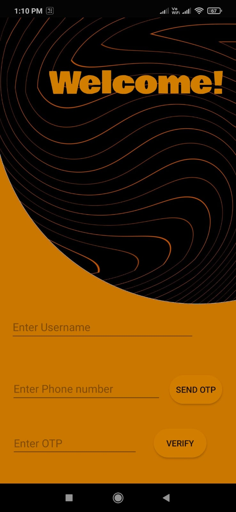
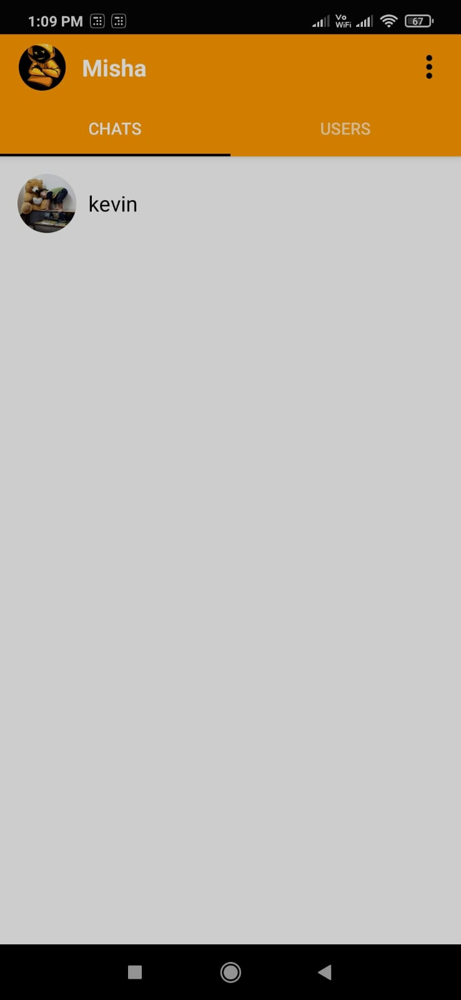
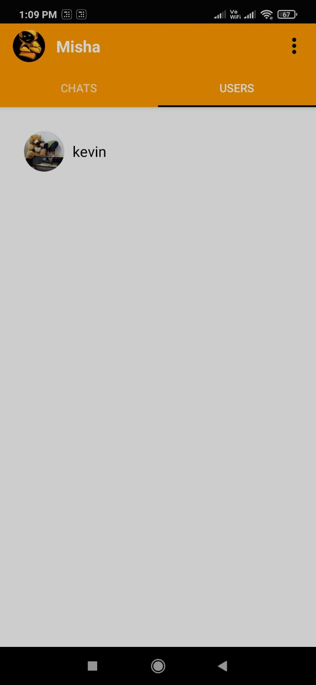
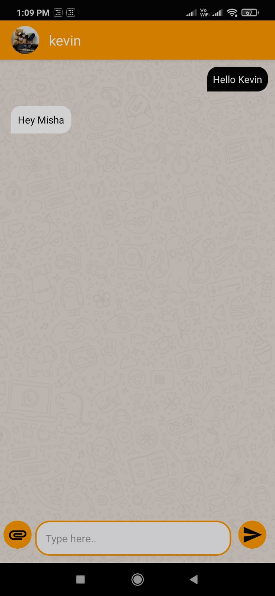

# ChitChat - Chatting Application

## About the Project

- A `distributed chatting application` that enables `private messaging` with end-to-end encryption.
- Formulated `Firebase Realtime Database` to store chat history and user profile details that `reduced data access time to 1 sec`.
- Programmed feature that allows users to edit their profile picture.

## Features of the Project

- The application uses `Firebase Phone Authentication` for registration and login.
- The `Main Page` holds two sections namely, `Chats and Users`. `Chats` section presents the list of users you have conversed with, while the `Users` section presents the list of users using the application.
- Single tap on any user profile direct you to the `chatting page` where the messages you send are displayed in black background with white text on the right and the received messages are displayed in white background with black text on the left.

## Screenshots of the application

### 1. Splash Screen and Login Page

<table>
        <tr> 
        <td></td>
        <td></td>
        </tr>
</table>

### 2. Chats Tab and Users Tab

<table>
        <tr> 
        <td></td>
        <td></td>
        </tr>
</table>

### 3. Chatting Page

<table>
        <tr> 
                <td></td>
        </tr>
</table>

## Technology

- `JAVA` for back-end
- `XML` for front-end
- `Firebase` for database

## Tools

- `Android Studio`
- `Git`
- `GitHub`

## Setting up project

1. Fork this project by clicking the Fork button on top right corner of this page.

2. Clone the repository by running following command in git:

   `$ git clone https://github.com/[YOUR-USERNAME]/ChitChat.git`
